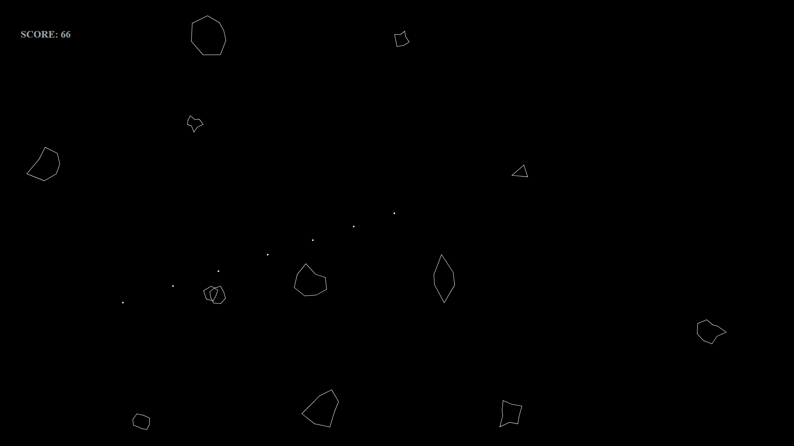
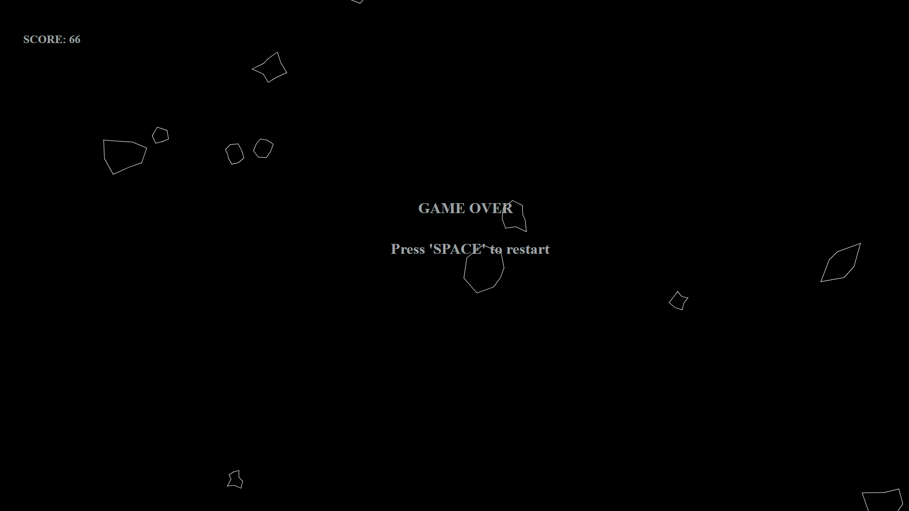

# About the game
This is a representation of an old game called 'Asteroids' written on JavaScript. Library I used is [p5.js](https://p5js.org). 

# Music
All sounds in the game were made by Empty Sphere. Here are links to [SoundCloud](https://soundcloud.com/empty_sphere) and to [GitHub](https://github.com/PeterUA) 

# Here are some screenshots of the game

 - 

 - 
